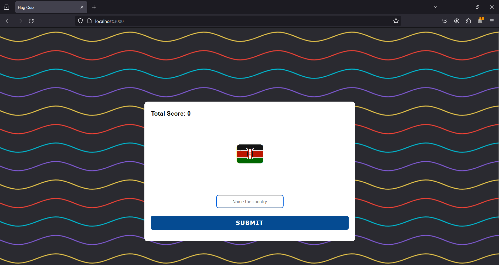
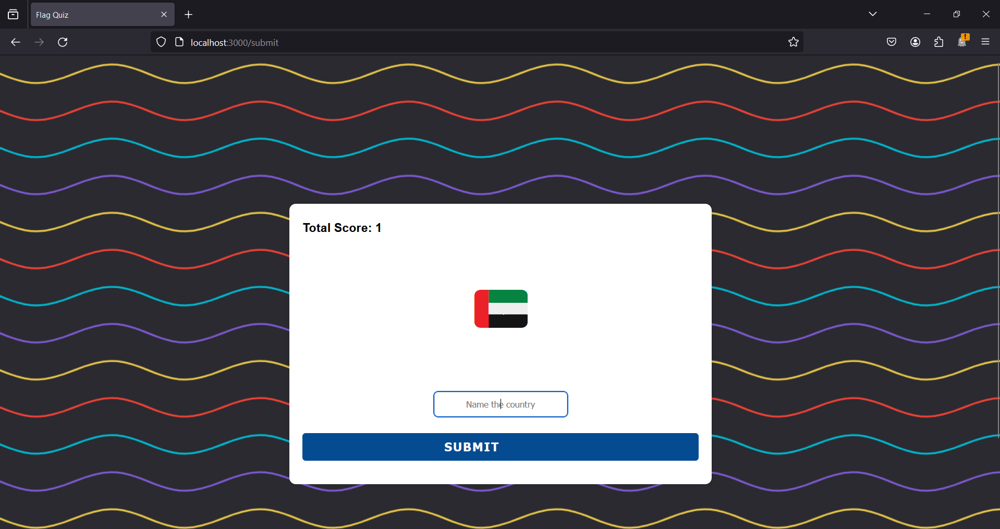

# Flag Guessing Game with EJS and Express.js

Welcome to the Flag Guessing Game built with EJS and Express.js! Test your knowledge of countries' flags by correctly identifying them.

## How to Play

1. Clone this repository to your local machine.
2. Make sure you have Node.js and npm installed.
3. Navigate to the repository directory in your terminal.
4. Install dependencies by running: npm i -y
5. Start the server by node index.js
   ```bash
   node index.js

   ```bash
   node index.js
## Images


